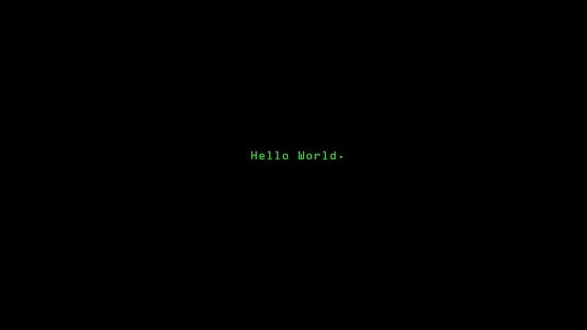

<h2>Hi, I'm Subhasis Mallick</h2>

<h3>Data Science Student</h3>

Building with code, data & creativity 

---

## 🚀 About Me

I'm a Data Science student passionate about building practical projects
that combine **software development, data, and creativity**.

- 🎓 Data Science Student
- 💻 Python, Java & C
- 📊 Data Science & Statistics
- 🗄️ SQL & DBMS
- 🌐 Web Development
- 🤖 Machine Learning & Computer Vision
- 🎨 Digital Illustration & Design

Currently, I'm focused on improving my development skills and building
projects that solve real-world problems.

---

## 🤝 Connect

---

## 💻 Tech Stack

  

---

## 📊 GitHub Stats

 

---

## 📈 Activity Graph

---

## 🚀 Featured Projects

---

### 🌱 Always learning. Always building.

⭐ Thanks for visiting my profile!

